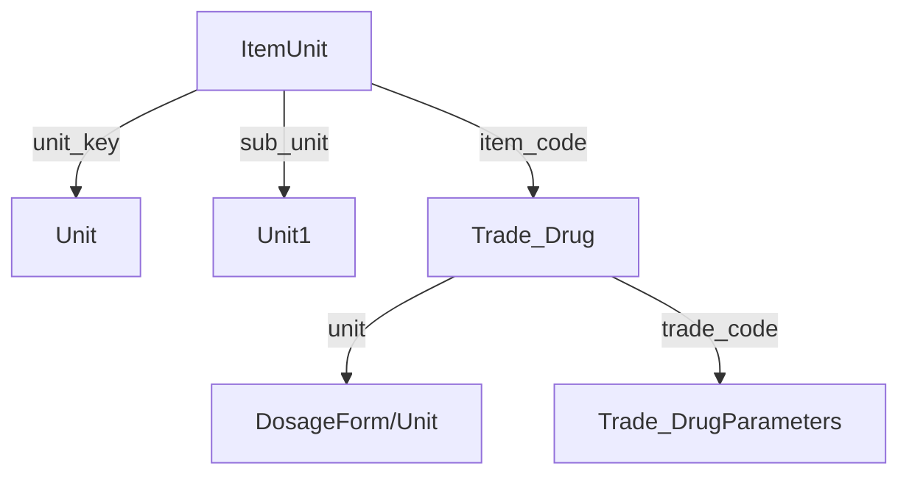
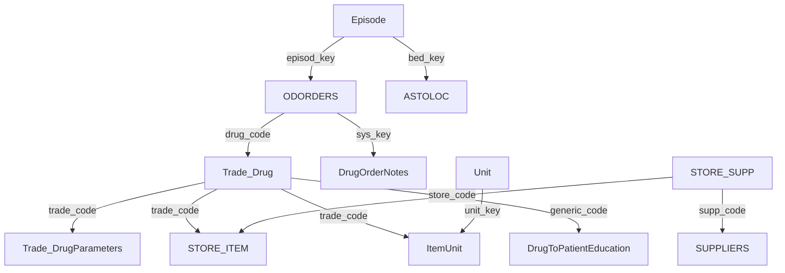
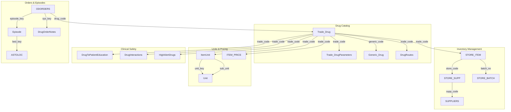

#### Launch procedures

1. *Gap fit analysis: System preview (medica cloudcare) 
2. Feedback and discussions
3. User acceptance Test UAT
4. Data Gathering (Pharmacy info, Drug Info) 
5. Crew Training  // Preview 2 cycles (Pharmacy setup) | (Dispensing)
6. Pharmacy Coding and Staff Assignment
7. Drug Activation 
8. Maintenance and system reviews  
9. Support and Problem Solving 


#### Role and User assignments

User definition > User To Role > User assignment > Assign user to user (Between peers to view mutual cases | Assign to all ) 
Role to Function assignment ( To view different functions to certain roles)
Dashboard assignment ( Home Page )
Assign user to hospital ( To assign same pharmacist to different hospitals)

## Store Setup

- To build The structure of the Pharmacy store from the ground up
- 3 Main types, Main store (المخزن) for suppliers, drug store (الصيدليه) for prescribers, Substore to charge patient directly for amenities (مستلزمات)
- Floor stock medications are stored As Substores with consumables 
- Staff assignments and management is important to assign transactions and staff to pharmacies
- You have to assign yourself to a store to have visibility 
- 

**Definitions** 
*Floor stock medications: Medications that are available for patients on the bed side av
ailable for nursers 


| table      | specs                   |
| ---------- | ----------------------- |
| trade_drug | drugs database          |
| STORE      | all store and its types |
| Itemunit   | packaging in Drug DB    |
|            |                         |
|            |                         |

### key relationships found in the procedure: ((phm_DrugListDetails))

1. **Order-Patient-Episode Relationship**
```sql
ODORDERS/IVOrders --> Episode --> Patient
```
- Orders are linked to episodes through `episode_key`
- Episodes are linked to patients through `patient_id`
- Example from code:
```sql
from ODORDERS with(nolock) 
inner join episode with(nolock) on episode.episod_key=ODORDERS.episode_key 
cross apply dbo.SharedMRN(episode.HospitalID)PATIENT
```

2. **Orders-Drug Catalog Relationship**
```sql
ODORDERS/IVOrders --> Trade_Drug --> Trade_DrugParameters
```
- Orders reference drugs through `drug_code`
- Links to drug master data for properties like:
  - Controlled substance status (`cont_med`)
  - High risk status (`HighRisk`)
  - Generic code
```sql
inner join trade_drugParameters with(nolock) on trade_code=drug_code
inner join trade_Drug with(nolock) on trade_Drug.trade_code=trade_drugParameters.trade_code
```

3. **IV Orders Hierarchy**
```sql
IVOrders (Parent) --> IVOrderDetails (Child)
```
- Main IV order links to detailed components
- Relationship through `ParentKey`:
```sql
IVOrders with(nolock) inner join
IVOrderDetails with(nolock) on IVOrders.Sys_Key=IVOrderDetails.ParentKey
```

4. **Location/Clinic Relationships**
```sql
Orders --> Episode --> HOSPSTRUCT/ASTOLOC
```
- Episodes link to locations through `bed_key`
- Locations link to stores through `store_code`
```sql
left join ASTOLOC with(nolock) on ASTOLOC.locationkey=EPISODE.bed_key
left outer join HOSPSTRUCT with(nolock) on HOSPSTRUCT.SYS_KEY=episode.bed_key
```

5. **Order-Staff Relationship**
```sql
Orders --> Staff --> Specialty
```
- Orders link to prescribing staff
- Staff links to their specialties
```sql
inner join staff with(nolock) on staff.staff_key=IVOrders.OrderDr 
inner join specialty on specialty.Specialty_Key=staff_Spec
```

6. **Drug Unit Relationships**
```sql
Orders --> ItemUnit --> Unit
```
- Links medication orders to their units of measure
```sql
inner join itemunit with(nolock) on ItemUnit.sys_key=IVOrders.Unit 
inner join unit with(nolock) on unit.unit_key=itemunit.unit_key
```

7. **Store-Clinic Filtering**
```sql
StoreClinicFilter --> ASTOLOC
```
- Controls which clinics can order from which stores
```sql
select LocationKey into #ClinicFilter 
from StoreClinicFilter 
where StoreCode=@Store_Code and UserId=@Userid
```

Key Business Rules in These Relationships:
1. **Order Status Flow**
- Orders track dispensing status (`flag_disp`)
- Clinical review requirements
- Billing verification status

2. **Inventory Control**
- Stock availability checking
- Floor stock designation
- ADC (Automated Dispensing Cabinet) items

3. **Security/Access Control**
- Store-clinic assignments
- User permissions
- Hospital-specific settings

4. **Order Type Handling**
- Regular medication orders (ODORDERS)
- IV orders with components (IVOrders + IVOrderDetails)
- Non-coded drug orders (NonCodedDrugOrders)

These relationships support a comprehensive medication management system that handles:
- Order entry and verification
- Inventory management
- Clinical workflows
- Dispensing processes
- Patient safety checks


# KEY TABLES

Here are all the key tables mentioned in the script, organized by their primary functions:

 - Flag_disp 
(0) not dispensed 
(1) partially dispensed 
(2) fully dispensed 
- status (active,inactive)
- OrderType (0 regular, 1 continuous)
- Episode key (رقم الزياره)
- Hospital_ID (رقم المستشفي)
- patient_id  (id)
- pat_id_crd_no (National ID)
- PatLocName ( arabic name)
- PatEngName (Eng name)

**1. Order Management Tables**
```sql
1. ODORDERS
- Primary table for regular medication orders
- Key fields: sys_key, patient_id, episode_key, drug_code, status, flag_disp, order_date

2. IVOrders
- Manages IV medication orders
- Key fields: sys_key, patient_id, episode_key, drug_code, OrderType

3. IVOrderDetails
- Child table for IV order components
- Key fields: sys_key, ParentKey, drug_code, Usage, Flagdisp

4. NonCodedDrugOrders
- Handles non-standard medication orders
- Key fields: sys_key, patient_id, episode_key, DrugName
```

**2. Patient/Episode Tables**
```sql
1. Episode
- Manages patient visits/episodes
- Key fields: episod_key, patient_id, bed_key, HospitalID

2. PATIENT (referenced through SharedMRN function)
- Patient demographics
- Key fields: patient_id, pat_id_crd_no, PatLocName, PatEngName
```

**3. Drug Catalog Tables**
```sql
1. Trade_Drug
- Drug master data
- Key fields: trade_code, cont_med, HighRisk

2. Trade_DrugParameters
- Additional drug parameters
- Key fields: trade_code, HospitalID, PhmPreparationInstruction

3. DrugRoutes
- Medication administration routes
- Key fields: SysKey, RouteEName
```

**4. Location/Facility Tables**
```sql
1. HOSPSTRUCT
- Hospital structure/locations
- Key fields: SYS_KEY, LATIN_DESC

2. ASTOLOC
- Store-location assignments
- Key fields: locationkey, storekey, store_code

3. StoreClinicFilter
- Store-clinic relationships
- Key fields: LocationKey, StoreCode, UserId
```

**5. Staff/Provider Tables**
```sql
1. Staff
- Healthcare provider information
- Key fields: staff_key, staff_name

2. Specialty
- Provider specialties
- Key fields: Specialty_Key
```

**6. Unit/Measurement Tables**
```sql
1. ItemUnit
- Item-specific units
- Key fields: sys_key, item_code, unit_key, conver_fact

2. Unit
- Unit master data
- Key fields: unit_key, unit_name_latin
```

**7. Billing/Financial Tables**
```sql
1. PAT_BILLING
- Patient billing records
- Key fields: episode_key, val_serv

2. COMP_BILLING
- Company billing records
- Key fields: episode_key, patient_val

3. PENDPAYDETAIL
- Pending payment details
- Key fields: patient_id, ORIGKEY, STATUS
```

**8. Inventory Tables**
```sql
1. STORE_ITEM
- Store inventory
- Key fields: store_code, item_code, min_qty

2. ADC_Location_Assignment
- Automated dispensing cabinet locations
- Key fields: ADCStore, LocationKey
```

**9. Clinical Documentation Tables**
```sql
1. DrugToPatientEducation
- Patient education materials
- Key fields: HospitalID, DrugCode, Screen

2. EOC_Diag_Orders
- Diagnosis-order relationships
- Key fields: Order_Key, Order_Type, Diag_Id
```

**10. Template/Order Set Tables**
```sql
1. DrugOrderTemplate
- Medication order templates
- Key fields: Sys_Key, TemplateName
```

**Temporary Tables Used:**
```sql
1. #ClinicFilter
2. #OrdersList
3. #ODOrdersList
4. @BillingTable
5. @PatList
6. @DrugOrderQty
7. @TotalSingleDoseQty
```

These tables form an interconnected system that manages:
- Medication ordering
- Inventory control
- Clinical workflows
- Patient safety
- Billing/financial processes
- Location/facility management
- Staff management
- Documentation requirements

The relationships between these tables enable complex workflows while maintaining data integrity and supporting various business rules.


## Phm_drugRefilActions


## Phm_drugUnitsPrint


Let me analyze the stored procedure `Phm_DrugUnitsPrint`:

**Parameters:**
```sql
@HospitalID int        -- Hospital identifier
@Units varchar(max)    -- Comma-separated list of drug forms/units
```

**Key Tables Used:**

1. **ItemUnit** (Main Table)
```sql
Primary table for drug unit configurations
Fields used:
- unit_key
- sub_unit
- conver_sub
- conver_fact
- unit_price
- Outp_Unit_Price
- grd_unit (Stock Unit flag)
- BILL_ON_NEWREFILL (Billing Unit flag)
- NurseUnit
- PurUnit (Purchase Unit flag)
```

2. **Unit** (Referenced twice)
```sql
Master table for units of measure
Referenced as:
1. Unit: Main unit
   - unit_key
   - unit_name_latin
2. Unit1: Sub unit
   - unit_key
   - unit_name_latin
3. DosageForm: For dosage form
   - unit_key
   - unit_Name_latin
```

3. **Trade_Drug**
```sql
Drug catalog table
Fields used:
- trade_code
- trade_name
- trade_codex (Hospital Code)
- unit (links to DosageForm)
```

4. **Trade_DrugParameters**
```sql
Drug parameters table
Fields used:
- trade_code
- InActive
- trade_form
```

**Relationships:**


**Query Structure:**
```sql:Phm_DrugUnitsPrint
SELECT DISTINCT
    DOSAGEFORM.unit_Name_latin as DosageForm,
    trade_name DrugName,
    Unit.unit_name_latin as Unit,
    Unit1.unit_name_latin as SubUnit,
    // ... conversion and price fields ...
    // ... unit type flags ...
    trade_drug.trade_code as SystemCode,
    trade_drug.trade_codex HospitalCode
FROM ItemUnit
    INNER JOIN Unit ON ItemUnit.unit_key = Unit.unit_key
    INNER JOIN Unit Unit1 ON Unit1.unit_key = ItemUnit.sub_unit
    INNER JOIN trade_drug ON ItemUnit.item_code = trade_drug.trade_code
    INNER JOIN trade_drugParameters ON trade_drug.trade_code = trade_drugParameters.trade_code
    INNER JOIN unit DosageForm ON DosageForm.unit_key = trade_drug.unit
WHERE 
    ISNULL(trade_drugParameters.InActive,0) = 0 
    AND trade_form IN (SELECT data FROM Split(@Units,','))
```

**Key Business Logic:**
1. **Unit Conversions:**
   - Shows conversion between main and sub units
   - Displays conversion factors

2. **Pricing Information:**
   - Unit price
   - Outpatient unit price

3. **Unit Type Flags:**
   - Stock Unit (`grd_unit`)
   - Billing Unit (`BILL_ON_NEWREFILL`)
   - Nurse Unit (`NurseUnit`)
   - Purchase Unit (`PurUnit`)

4. **Filtering:**
   - Only active drugs
   - Specific trade forms from parameter
   - Uses custom Split function for parameter parsing

**Purpose:**
This procedure appears to be used for:
1. Printing/reporting drug unit configurations
2. Showing unit conversions and relationships
3. Displaying pricing information
4. Identifying different unit types for various purposes (stock, billing, nursing, purchasing)
5. Filtering by specific drug forms/units

The procedure is likely part of a larger pharmacy system, supporting:
- Inventory management
- Drug dispensing
- Billing operations
- Nursing administration
- Purchasing operations


## phm_druhlistdetails


Let me analyze the stored procedure `Phm_DrugListDetails`:

**Parameters:**
```sql
@HospitalID int          -- Hospital identifier
@DrugCode varchar(20)    -- Drug code
@ByGeneric bit          -- Generic/Brand flag
@Store_Code int         -- Store/Pharmacy code
@OrderKey int           -- Order key
@BarCode varchar(50)    -- Barcode
@EpisodeKey int         -- Episode key
@PatientStore int      -- Patient's assigned store
@PatientID varchar(20)  -- Patient identifier
@Type int              -- Type of request
@SchedSer int          -- Schedule series
@PharmUnit int         -- Pharmacy unit
```

**Key Tables and Their Important Fields:**

1. **Trade_Drug**
```sql
- trade_code
- trade_name
- generic_code
- cont_med (controlled medication)
- HighRisk
```

2. **Trade_DrugParameters**
```sql
- trade_code
- HospitalID
- InActive
- PhmPreparationInstruction
```

3. **STORE_ITEM**
```sql
- store_code
- item_code
- batch_no
- expiry_date
- qty_in_hand
- min_qty
```

4. **ItemUnit**
```sql
- item_code
- unit_key
- conver_fact
- NurseUnit
- grd_unit
```

5. **DrugToPatientEducation**
```sql
- DrugCode
- Generic_code
- HospitalID
- Screen
```

**Relationships Diagram:**



**Key Relationships:**

1. **Drug Catalog Relations:**
```sql
Trade_Drug --> Trade_DrugParameters
- Linked by trade_code
- Hospital-specific drug parameters
```

2. **Inventory Relations:**
```sql
Trade_Drug --> STORE_ITEM
- Tracks stock levels
- Batch and expiry information
```

3. **Unit Relations:**
```sql
Trade_Drug --> ItemUnit --> Unit
- Drug unit configurations
- Conversion factors
```

4. **Patient Education:**
```sql
Trade_Drug --> DrugToPatientEducation
- Links drugs to education materials
- Supports both generic and brand-specific materials
```

5. **Order Relations:**
```sql
ODORDERS --> Trade_Drug
ODORDERS --> DrugOrderNotes
- Links orders to drugs
- Captures additional notes
```

**Business Logic Highlights:**

1. **Stock Availability:**
```sql
- Checks multiple stores
- Considers minimum quantities
- Tracks batch/expiry
```

2. **Unit Conversions:**
```sql
- Stock to dispensing units
- Billing units
- Nurse administration units
```

3. **Patient Safety:**
```sql
- High risk drug identification
- Controlled substance handling
- Patient education materials
```

4. **Store Management:**
```sql
- Multi-store inventory
- Supplier information
- Store assignments
```

This procedure appears to be a central component for retrieving detailed drug information, supporting:
- Inventory management
- Drug dispensing
- Patient safety
- Clinical documentation
- Store operations


## MORE DETAILED

Let me provide a more detailed analysis of the `Phm_DrugListDetails` stored procedure:

**1. Core Purpose:**
This stored procedure appears to be a comprehensive drug information retrieval system that serves multiple pharmacy operations including inventory management, clinical safety, and dispensing workflows.

**2. Parameters Analysis:**
```sql
-- Primary Identifiers
@HospitalID int          -- Hospital context
@DrugCode varchar(20)    -- Drug identifier
@OrderKey int            -- Specific order reference
@EpisodeKey int          -- Patient visit identifier
@PatientID varchar(20)   -- Patient identifier

-- Operational Parameters
@ByGeneric bit          -- Controls generic/brand drug handling
@Store_Code int         -- Pharmacy location
@PatientStore int       -- Patient's assigned store
@Type int              -- Operation type indicator
@SchedSer int          -- Schedule/Series identifier
@PharmUnit int         -- Pharmacy unit of measure

-- Additional Parameters
@BarCode varchar(50)    -- Product barcode identifier
```

**3. Key Tables and Their Relationships:**



**4. Detailed Table Analysis:**

1. **Drug Catalog Tables:**
```sql
-- Trade_Drug (Primary Drug Table)
CREATE TABLE Trade_Drug (
    trade_code varchar(20) PRIMARY KEY,
    trade_name varchar(100),
    generic_code varchar(20),
    cont_med bit,           -- Controlled substance flag
    HighRisk bit,          -- High-risk medication
    trade_form int,        -- Dosage form
    unit int,              -- Base unit
    FOREIGN KEY (generic_code) REFERENCES Generic_Drug(generic_code)
)

-- Trade_DrugParameters (Hospital-Specific Settings)
CREATE TABLE Trade_DrugParameters (
    trade_code varchar(20),
    HospitalID int,
    InActive bit,
    PhmPreparationInstruction text,
    ConcentratedElectrolyte bit,
    PRIMARY KEY (trade_code, HospitalID)
)
```

2. **Inventory Management Tables:**
```sql
-- STORE_ITEM (Stock Management)
CREATE TABLE STORE_ITEM (
    store_code int,
    item_code varchar(20),
    batch_no varchar(50),
    expiry_date date,
    qty_in_hand decimal(18,2),
    min_qty decimal(18,2),
    max_qty decimal(18,2),
    location varchar(50),
    PRIMARY KEY (store_code, item_code, batch_no)
)

-- STORE_BATCH (Batch Tracking)
CREATE TABLE STORE_BATCH (
    batch_no varchar(50),
    item_code varchar(20),
    expiry_date date,
    supp_code int,
    cost decimal(18,2),
    PRIMARY KEY (batch_no, item_code)
)
```

3. **Unit Management Tables:**
```sql
-- ItemUnit (Drug Unit Configuration)
CREATE TABLE ItemUnit (
    sys_key int PRIMARY KEY,
    item_code varchar(20),
    unit_key int,
    sub_unit int,
    conver_fact decimal(18,6),
    conver_sub decimal(18,6),
    NurseUnit bit,
    grd_unit bit,         -- Stock unit flag
    BILL_ON_NEWREFILL bit -- Billing unit flag
)
```

**5. Key Business Logic Components:**

1. **Inventory Management:**
```sql
-- Stock Availability Check
SELECT SUM(qty_in_hand) 
FROM STORE_ITEM 
WHERE item_code = @DrugCode 
AND store_code = @Store_Code
AND expiry_date > GETDATE()
```

2. **Unit Conversions:**
```sql
-- Converting Between Units
SELECT 
    conver_fact,
    conver_sub,
    Unit.unit_name_latin
FROM ItemUnit 
JOIN Unit ON ItemUnit.unit_key = Unit.unit_key
WHERE item_code = @DrugCode
```

3. **Clinical Safety Checks:**
```sql
-- High Risk & Patient Education
SELECT 
    HighRisk,
    HasPatientEducation = CASE 
        WHEN EXISTS (SELECT 1 FROM DrugToPatientEducation 
                    WHERE DrugCode = @DrugCode) 
        THEN 1 ELSE 0 END
FROM Trade_Drug
```

**6. Common Use Cases:**

1. **Dispensing Workflow:**
- Drug availability check
- Unit conversion calculations
- Safety verification
- Patient education material identification

2. **Inventory Management:**
- Stock level monitoring
- Expiry tracking
- Multi-store inventory visibility
- Supplier information

3. **Clinical Safety:**
- High-risk drug identification
- Patient education requirements
- Drug interaction checking
- Controlled substance handling

4. **Financial Processing:**
- Unit price calculations
- Insurance coverage verification
- Billing unit determination

This stored procedure serves as a crucial component in the pharmacy system, providing comprehensive drug information necessary for safe and efficient medication management across multiple hospital functions.

The procedure's design suggests it's part of a larger healthcare system that integrates:
- Pharmacy operations
- Clinical safety
- Inventory management
- Financial processing
- Patient care documentation
