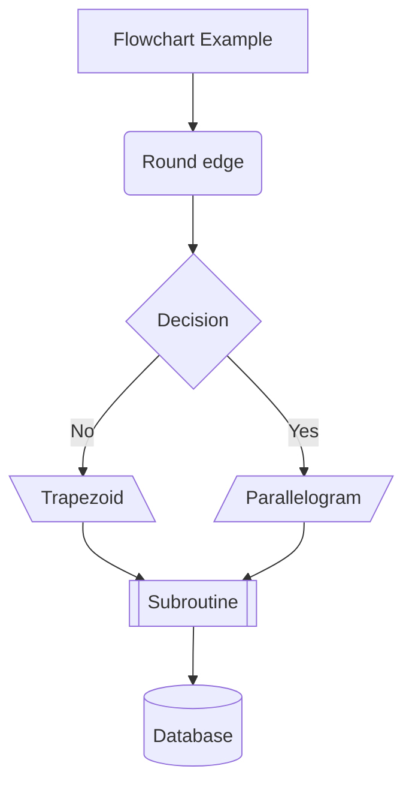
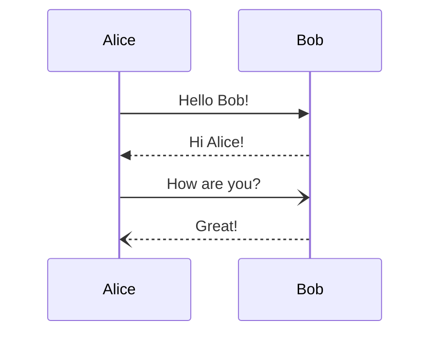
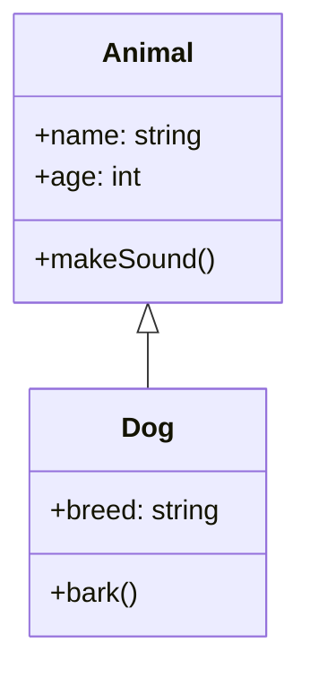
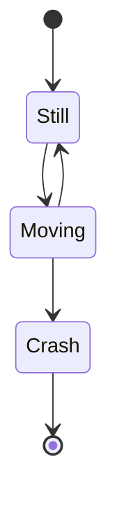
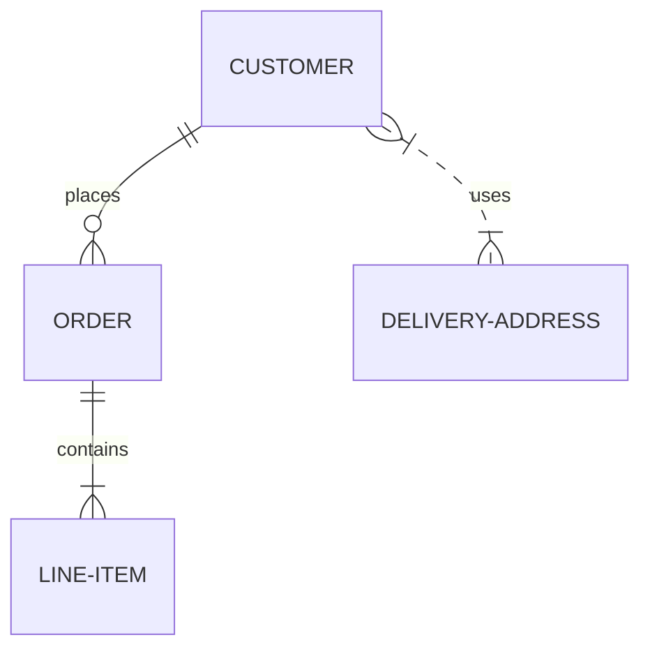

```mermaid
flowchart TD
    A[Flowchart Example] --> B(Round edge)
    B --> C{Decision}
    C -->|Yes| D[/Parallelogram/]
    C -->|No| E[\Trapezoid\]
    E --> F[[Subroutine]]
    D --> F
    F --> G[(Database)]
```

```mermaid
sequenceDiagram
    participant A as Alice
    participant B as Bob
    A->>B: Hello Bob!
    B-->>A: Hi Alice!
    A-)B: How are you?
    B--)A: Great!
```

```mermaid
classDiagram
    class Animal{
        +name: string
        +age: int
        +makeSound()
    }
    class Dog{
        +breed: string
        +bark()
    }
    Animal <|-- Dog
```

```mermaid
stateDiagram-v2
    [*] --> Still
    Still --> Moving
    Moving --> Still
    Moving --> Crash
    Crash --> [*]
```

```mermaid
stateDiagram-v2
    [*] --> Still
    Still --> Moving
    Moving --> Still
    Moving --> Crash
    Crash --> [*]
```

```mermaid 
erDiagram
    CUSTOMER ||--o{ ORDER : places
    ORDER ||--|{ LINE-ITEM : contains
    CUSTOMER }|..|{ DELIVERY-ADDRESS : uses
```
